# Temporal POC API

.NET Core 9 API with Temporal.io for transaction processing with idempotency guarantee.

## 📋 Requirements

- .NET 9 SDK
- Docker and Docker Compose

## 🚀 Quick Start

### Start All Services with Docker Compose

The entire application runs in Docker containers, including the API, Temporal server, PostgreSQL, and Temporal UI.

```bash
docker-compose up -d --build
```

This command will:
- **Build the API Docker images** - Compiles .NET 9 applications
  - `temporal-poc-api` - Main API with TransactionWorkflow
  - `temporal-poc-external-domain-api` - External API with Nexus integration
- **Start PostgreSQL database** - Temporal's persistence layer
- **Start Temporal server** - Workflow orchestration engine
  - Loads dynamic configuration from `config/dynamicconfig/docker.yaml`
  - Enables Nexus operations
  - Configures callback endpoints
- **Start Temporal UI** - Web interface for monitoring workflows
- **Initialize Search Attributes** - Creates custom search fields
  - ProfileId (Keyword)
  - ExternalOperationId (Keyword)
  - OperationType (Keyword)
- **Create Nexus Endpoint** - Sets up cross-namespace communication
  - Endpoint: `transaction-nexus-endpoint`
  - Target namespace: `default`
  - Target task queue: `default-task-queue`

**Wait 30-60 seconds** for all services to initialize completely.

### Verify Services are Running

```bash
docker-compose ps
```

You should see all containers with status `Up` or `Up (healthy)`:
- `temporal-poc-api` - Main API service (port 5000)
- `temporal-poc-external-domain-api` - External API with Nexus (port 6000)
- `temporal` - Temporal server (port 7233)
- `temporal-postgresql` - PostgreSQL database (port 5432)
- `temporal-ui` - Temporal web UI (port 8080)
- `temporal-init-search-attributes` - Exited (ran once to create search attributes)
- `temporal-init-nexus-endpoint` - Exited (ran once to create Nexus endpoint)

### Access Points

Once all services are running:

- **Main API**: `http://localhost:5000`
- **External Domain API (Nexus)**: `http://localhost:6000`
- **Temporal UI**: `http://localhost:8080`
- **Temporal Server (gRPC)**: `localhost:7233`
- **PostgreSQL**: `localhost:5432`
- **Swagger UI**: Available when running locally with `dotnet run` at `https://localhost:5001/swagger`

## 🔄 Refresh Docker After Code Changes

After making code changes, you need to rebuild and restart the containers:

### Option 1: Rebuild and Restart All Services

```bash
docker-compose down
docker-compose up -d --build
```

### Option 2: Rebuild Only the API (Faster)

```bash
docker-compose up -d --build api
```

### Option 3: Restart Without Rebuild (If Only Config Changed)

```bash
docker-compose restart api
```

### View API Logs

```bash
# Follow API logs in real-time
docker logs -f temporal-poc-api

# View last 50 lines
docker logs temporal-poc-api --tail 50
```

## 🖥️ Accessing Temporal UI

The Temporal UI provides a web interface to monitor and manage workflows.

### Access the UI

1. Open your browser and navigate to: **http://localhost:8080**

2. You'll see the Temporal UI dashboard with:
   - **Workflows** tab - View all workflows
   - **Namespaces** - Default namespace is `default`
   - **Task Queues** - See `default-task-queue`

### View Your Workflow

1. In the **Workflows** tab, search for your workflow ID:
   - Format: `operation-{OperationType}-{ExternalOperationId}`
   - Example: `operation-RadiusMailOrder-OP-12345-TEST`

2. Click on the workflow to see:
   - **Workflow Execution Details**
   - **Activities** executed (one per movement + webhook)
   - **Timeline** of execution
   - **Input/Output** of each activity
   - **Logs** and error details
   - **Retry attempts** if any

3. **Filter Options**:
   - Filter by Workflow ID
   - Filter by Status (Running, Completed, Failed)
   - Filter by Time Range

### Workflow Details View

When you click on a workflow, you can see:
- **Execution Time** - How long the workflow took
- **Activities List** - All activities executed in order
- **Activity Details** - Click any activity to see:
  - Input parameters
  - Output result
  - Execution time
  - Retry history
  - Error messages (if any)

### Useful Temporal UI Features

- **Replay Workflow** - Re-execute a workflow with the same input
- **Terminate Workflow** - Stop a running workflow
- **Cancel Workflow** - Cancel a scheduled workflow
- **View History** - See complete execution history

## 🔄 Temporal Workflow

### Characteristics:
- **Workflow ID**: `operation-{OperationType}-{ExternalOperationId}`
  - Ensures idempotency (same operation won't execute twice)
  
- **Task Queue**: `default-task-queue`

- **Processing Flow**:
  1. Orders movements by `Order` and `SubOrder`
  2. Creates an **Activity** for each movement
  3. Processes movements sequentially:
     - **Stripe**: Simulates Stripe integration, generates UniqueId
     - **Balance**: Simulates balance operation
  4. **Stripe Signal**: After Stripe movement, workflow waits for signal
     - **Success**: Continues processing remaining movements
     - **Failure**: Starts rollback workflow to revert all processed movements
  5. At the end, sends **Webhook** to `WebhookCallBackUrl`

### Activities:

#### MovementActivity
- Processes each movement based on `TransactionDestination`
- Supports: Stripe, Balance
- Automatic retry (up to 3 attempts)
- Timeout: 5 minutes

#### WebhookActivity
- Sends HTTP POST callback with operation status
- Automatic retry (up to 3 attempts)
- Timeout: 2 minutes

## 🏗️ Project Architecture

### Main API (Temporal.POC.api)
```
Temporal.POC.api/
├── Controllers/
│   └── TransactionController.cs      # POST /v1/transaction, /v1/stripe-signal, /v1/webhook
├── Models/
│   ├── TransactionRequest.cs         # Transaction request DTOs
│   └── StripeSignalRequest.cs        # Stripe signal request DTO
├── Workflows/
│   ├── TransactionWorkflow.cs        # Main transaction workflow
│   └── RollbackWorkflow.cs           # Rollback workflow for failures
├── Activities/
│   ├── MovementActivity.cs           # Processes Stripe and Balance movements
│   └── WebhookActivity.cs            # Sends HTTP callbacks
├── Services/
│   ├── TransactionServiceHandler.cs  # Nexus Service Handler (exposes workflow)
│   └── TemporalWorkerService.cs      # Custom worker with Nexus support
├── Extensions/
│   └── ServiceExtensions.cs          # DI container configuration
├── Config/
│   └── TemporalConfig.cs             # Temporal configuration model
└── Temporal.POC.api.csproj           # .NET 9 project with Temporalio + NexusRpc
```

### External Domain API (Temporal.POC.ExternalDomain.api)
```
Temporal.POC.ExternalDomain.api/
├── Controllers/
│   └── ExternalDomainController.cs   # POST /v1/external-domain/transaction
├── Models/
│   ├── ExternalDomainRequest.cs      # Simple request (ProfileId, ExternalOperationId, OperationType)
│   └── TransactionRequest.cs         # Full transaction model (created internally)
├── Workflows/
│   └── ExternalDomainWorkflow.cs     # Calls TransactionWorkflow via Nexus
├── Services/
│   └── ITransactionService.cs        # Nexus service contract interface
├── Extensions/
│   └── ServiceExtensions.cs          # DI container configuration
├── Config/
│   └── TemporalConfig.cs             # Temporal configuration model
└── Temporal.POC.ExternalDomain.api.csproj  # .NET 9 project with Temporalio + NexusRpc
```

### Infrastructure
```
├── config/
│   └── dynamicconfig/
│       └── docker.yaml               # Temporal dynamic config (enables Nexus)
├── docker-compose.yml                # All services orchestration
├── Dockerfile                        # Main API Docker image
├── init-search-attributes.sh         # Creates custom search attributes
├── setup-nexus-endpoint.sh           # Creates Nexus endpoint
├── TEST-COMMANDS.md                  # CURL examples for testing
└── README.md                         # This file
```

## 🛠️ Technologies Used

### Core Framework
- **.NET 9** - Latest .NET framework
- **ASP.NET Core 9** - Web API framework
- **C# 12** - Programming language

### Temporal Ecosystem
- **Temporal.io** - Durable workflow orchestration platform
- **Temporalio SDK 1.9.0** - Official .NET SDK for Temporal (Pre-Release)
- **Temporalio.Extensions.Hosting** - ASP.NET Core integration for Temporal
- **Temporal Nexus** - Cross-namespace workflow communication (enables microservices architecture)
- **NexusRpc 0.2.0** - .NET library for Nexus service contracts and handlers

### Temporal Features Used
- **Workflows** - Durable, long-running business processes
- **Activities** - Individual units of work with automatic retry
- **Signals** - Send data to running workflows (e.g., Stripe payment confirmation)
- **Search Attributes** - Custom fields for filtering workflows in UI
- **Nexus Operations** - Asynchronous cross-namespace workflow calls

### Infrastructure
- **Docker** - Containerization platform
- **Docker Compose** - Multi-container orchestration
- **PostgreSQL 15 Alpine** - Lightweight database for Temporal persistence
- **temporalio/auto-setup** - Temporal server with auto-configuration
- **temporalio/ui** - Official Temporal web interface

### Additional Tools
- **Swagger/OpenAPI** - API documentation (available when running locally with `dotnet run`)

## 📦 Docker Compose Services

### Running Services (Always Active)

#### 1. **postgresql** - PostgreSQL Database
- **Port**: `5432`
- **Access**: `localhost:5432`
- **Credentials**: `temporal/temporal`
- **Purpose**: Temporal's persistence layer
- **Stores**: All workflow history, state, and metadata
- **Volume**: `postgres-data` (data persists across restarts)
- **Image**: `postgres:15-alpine`

#### 2. **temporal** - Temporal Server
- **Port**: `7233` (gRPC)
- **Access**: Via Temporal SDK or tctl CLI (not browser accessible)
- **Purpose**: Workflow orchestration engine
- **Features**:
  - Manages workflow execution and state
  - Handles activity retries and timeouts
  - Enables Nexus operations
  - Stores history in PostgreSQL
- **Configuration**: Loads `config/dynamicconfig/docker.yaml` for Nexus
- **Image**: `temporalio/auto-setup:latest`

#### 3. **temporal-ui** - Temporal Web UI
- **Port**: `8080`
- **Access**: **http://localhost:8080** (open in browser)
- **Purpose**: Visual interface for monitoring workflows
- **Features**:
  - View all workflows and execution history
  - Monitor workflow status (Running, Completed, Failed)
  - Browse activities and events timeline
  - Search by custom attributes (ProfileId, ExternalOperationId, OperationType)
  - Replay, terminate, or cancel workflows
  - View Nexus endpoints and operations
- **Image**: `temporalio/ui:latest`

#### 4. **api** - Main Transaction API
- **Port**: `5000`
- **Access**: **http://localhost:5000**
- **Purpose**: Primary API for transaction processing
- **Endpoints**:
  - `POST /v1/transaction` - Create new transaction
  - `POST /v1/stripe-signal` - Send Stripe payment signal
  - `POST /v1/webhook` - Internal webhook receiver
- **Workflows**:
  - TransactionWorkflow - Main transaction processing
  - RollbackWorkflow - Handles transaction rollback
- **Activities**:
  - MovementActivity - Processes Stripe and Balance operations
  - WebhookActivity - Sends HTTP callbacks
- **Nexus**: Exposes TransactionServiceHandler for cross-namespace calls
- **Worker**: Custom TemporalWorkerService with Nexus support
- **Image**: Built from `./Dockerfile`

#### 5. **external-domain-api** - External Domain API (Nexus Client)
- **Port**: `6000`
- **Access**: **http://localhost:6000**
- **Purpose**: Independent API demonstrating Nexus integration
- **Endpoints**:
  - `POST /v1/external-domain/transaction` - Create transaction via Nexus
    - Body: `{ "profileId": 1010, "externalOperationId": "OP-001", "operationType": "RadiusMailOrder" }`
- **Workflow**:
  - ExternalDomainWorkflow - Calls TransactionWorkflow via Nexus
- **Features**:
  - Completely decoupled from main API
  - Communicates only via Nexus (cross-namespace)
  - Creates full TransactionRequest internally
  - Receives results via worker polling
- **Image**: Built from `./Temporal.POC.ExternalDomain.api/Dockerfile`

### Init Services (Run Once on Startup)

#### 6. **init-search-attributes** - Search Attributes Setup
- **Purpose**: Creates custom search attributes in Temporal
- **Lifecycle**: Runs once, then exits
- **Creates**:
  - `ProfileId` (Keyword) - Filter workflows by profile
  - `ExternalOperationId` (Keyword) - Filter by operation ID
  - `OperationType` (Keyword) - Filter by operation type
- **Script**: `./init-search-attributes.sh`
- **Image**: `temporalio/auto-setup:latest`

#### 7. **init-nexus-endpoint** - Nexus Endpoint Setup
- **Purpose**: Creates Nexus endpoint for cross-namespace calls
- **Lifecycle**: Runs once, then exits
- **Creates**: `transaction-nexus-endpoint`
  - Target namespace: `default`
  - Target task queue: `default-task-queue`
- **Script**: `./setup-nexus-endpoint.sh`
- **Image**: `temporalio/auto-setup:latest`

## ⚙️ Configuration

### Application Settings

Both APIs use `appsettings.json` and `appsettings.Development.json` for configuration:

**Temporal.POC.api/appsettings.json:**
```json
{
  "Temporal": {
    "Address": "localhost",
    "Port": 7233,
    "Namespace": "default",
    "Identity": "Temporal.POC.api",
    "TaskQueue": "default-task-queue",
    "WorkflowIdReusePolicy": "RejectDuplicate",
    "Worker": {
      "MaxConcurrentWorkflowTasks": 100,
      "MaxConcurrentActivities": 100,
      "MaxConcurrentLocalActivities": 100,
      "MaxConcurrentActivityTaskPolls": 5,
      "MaxConcurrentWorkflowTaskPolls": 5
    }
  }
}
```

**Temporal.POC.ExternalDomain.api/appsettings.json:**
```json
{
  "Temporal": {
    "Address": "localhost",
    "Port": 7233,
    "Namespace": "default",
    "Identity": "Temporal.POC.ExternalDomain.api",
    "TaskQueue": "external-domain-task-queue",
    "WorkflowIdReusePolicy": "RejectDuplicate"
  }
}
```

**Note**: When running in Docker, environment variables override these settings:
- `Temporal__Address=temporal` (uses Docker service name)
- `Temporal__Port=7233`

### Temporal Server Dynamic Configuration

**config/dynamicconfig/docker.yaml:**
```yaml
# Enable Nexus operations
system.enableNexus:
  - value: true
    constraints: {}

# Nexus callback endpoint (required even though HTTP callback fails with 404)
component.nexusoperations.callback.endpoint.template:
  - value: "http://127.0.0.1:7243/namespaces/{{.NamespaceName}}/nexus/callback"
    constraints: {}

# Allow callbacks from any address (development only)
component.callbacks.allowedAddresses:
  - value:
      - Pattern: "*"
        AllowInsecure: true
```

**Critical Notes:**
- Port **7243** is Temporal's internal HTTP endpoint
- This configuration is **MANDATORY** for Nexus to work
- HTTP callback will fail with 404 (expected - SDK 1.9.0 limitation)
- Worker processes results via **polling**, not HTTP callbacks

## 🛑 Stop Services

### Stop Containers (Keep Data)

```bash
docker-compose down
```

This will stop and remove containers but keep volumes (data persists).

### Stop and Remove All Data

```bash
docker-compose down -v
```

This will stop containers and remove volumes (all workflow history will be deleted).

### Clean Everything and Start Fresh

If you want to completely clean Docker and rebuild from scratch with fresh images:

```bash
# Step 1: Stop all containers and remove volumes
docker-compose down -v

# Step 2: Remove all Docker images, containers, and build cache
docker system prune -a --volumes -f

# Step 3: Rebuild and start everything from scratch
docker-compose up -d --build
```

**What gets deleted:**
- All containers
- All Docker images (Temporal, PostgreSQL, APIs, UI)
- All volumes (workflow history, database data)
- All build cache
- All networks

**What happens on rebuild:**
- Fresh download of Temporal and PostgreSQL images
- Clean compilation of .NET applications
- New database without any workflow history
- Fresh Nexus endpoint creation
- New search attributes setup

**Note**: This is useful when:
- You want to test with a completely clean environment
- You've made significant infrastructure changes
- You're troubleshooting persistent Docker issues
- You want to remove all traces of old workflows

## 📊 View Logs

```bash
# API logs
docker logs -f temporal-poc-api

# Temporal server logs
docker logs -f temporal

# PostgreSQL logs
docker logs -f temporal-postgresql

# All services logs
docker-compose logs -f
```

## 🔍 Search Attributes

The workflow automatically includes Search Attributes for filtering in Temporal UI:
- **ProfileId** (Keyword) - Profile identifier
- **ExternalOperationId** (Keyword) - External operation ID
- **OperationType** (Keyword) - Operation type

### Automatic Setup

**Search Attributes are automatically created when you start the services with `docker-compose up`.**

The `init-search-attributes` service runs automatically after Temporal is ready and creates all required Search Attributes. You don't need to run any manual setup commands.

### Manual Setup (Optional)

If you need to recreate Search Attributes manually, you can use the provided scripts:

**Windows PowerShell:**
```powershell
.\setup-search-attributes.ps1
```

**Linux/Mac/Bash:**
```bash
chmod +x setup-search-attributes.sh
./setup-search-attributes.sh
```

After setup, workflows will automatically include these Search Attributes, allowing you to filter workflows in Temporal UI by ProfileId, ExternalOperationId, or OperationType.

## 🧪 Testing

For complete testing instructions, examples, and curl commands, see **[TEST-COMMANDS.md](TEST-COMMANDS.md)**.

The test documentation includes:
- How to test success and failure scenarios
- Complete curl commands for Postman
- How to send signals to workflows
- How to monitor workflows in Temporal UI

## 🔒 Temporal Guarantees

- **Durability**: Workflow state persists across failures
- **Idempotency**: Unique WorkflowId prevents duplication
- **Automatic Retry**: Activities with configurable retry policy
- **Timeout Protection**: Protection against stuck processes
- **Observability**: Logs and metrics via Temporal UI

## 🐛 Troubleshooting

### API not connecting to Temporal

1. Check if Temporal is healthy:
   ```bash
   docker-compose ps
   ```

2. Check Temporal logs:
   ```bash
   docker logs temporal
   ```

3. Verify API can reach Temporal:
   ```bash
   docker exec temporal-poc-api ping -c 2 temporal
   ```

### Workflow not appearing in UI

1. Wait a few seconds for the workflow to be registered
2. Refresh the Temporal UI page
3. Check the correct namespace (`default`)
4. Verify the workflow ID format matches

### Container build fails

1. Clean Docker build cache:
   ```bash
   docker-compose build --no-cache
   ```

2. Remove old images:
   ```bash
   docker system prune -a
   ```

## 🎯 System Architecture & Flow

### Component Communication Flow

The following diagram illustrates how all components interact, including the two APIs, Temporal Server, Nexus communication, and signal handling for success/rollback scenarios.

```mermaid
sequenceDiagram
    participant Client
    participant ExternalAPI as External Domain API<br/>(Port 6000)
    participant Temporal as Temporal Server<br/>(Port 7233)
    participant MainAPI as Main API<br/>(Port 5000)
    participant Stripe as Stripe Service
    participant Webhook as Webhook Callback

    Note over Client,Webhook: Scenario 1: Transaction via Nexus (Success Flow)
    
    Client->>ExternalAPI: POST /v1/external-domain/transaction<br/>{profileId, externalOperationId, operationType}
    ExternalAPI->>ExternalAPI: Create TransactionRequest internally
    ExternalAPI->>Temporal: Start ExternalDomainWorkflow
    Temporal->>ExternalAPI: ExternalDomainWorkflow running
    
    ExternalAPI->>Temporal: Call TransactionWorkflow via Nexus<br/>(transaction-nexus-endpoint)
    Note over Temporal: Nexus routes to MainAPI worker
    Temporal->>MainAPI: Execute TransactionWorkflow<br/>(via Nexus Service Handler)
    
    MainAPI->>MainAPI: Process Movement 1: Stripe
    MainAPI->>Stripe: ChargeStripeAccount Activity
    Stripe-->>MainAPI: Movement processed
    MainAPI->>Temporal: Wait for Stripe Signal
    
    Note over Client,Webhook: External system sends Stripe signal
    
    Client->>MainAPI: POST /v1/stripe-signal<br/>{Success: true, ExternalOperationId, OperationType}
    MainAPI->>Temporal: Send Signal: StripeSuccess
    Temporal->>MainAPI: Signal received, continue workflow
    
    MainAPI->>MainAPI: Process Movement 2: Balance Credit
    MainAPI->>MainAPI: Process Movement 3: Balance Charge
    MainAPI->>Webhook: Send Webhook Activity
    Webhook-->>MainAPI: Webhook sent successfully
    
    MainAPI->>Temporal: TransactionWorkflow completed
    Temporal->>ExternalAPI: Nexus operation result (via polling)
    ExternalAPI->>ExternalAPI: ExternalDomainWorkflow completed
    ExternalAPI-->>Client: 202 Accepted<br/>{workflowId, runId}

    Note over Client,Webhook: Scenario 2: Transaction via Nexus (Failure Flow - Rollback)
    
    Client->>ExternalAPI: POST /v1/external-domain/transaction
    ExternalAPI->>Temporal: Start ExternalDomainWorkflow
    ExternalAPI->>Temporal: Call TransactionWorkflow via Nexus
    Temporal->>MainAPI: Execute TransactionWorkflow
    
    MainAPI->>MainAPI: Process Movement 1: Stripe
    MainAPI->>Stripe: ChargeStripeAccount Activity
    Stripe-->>MainAPI: Movement processed
    MainAPI->>Temporal: Wait for Stripe Signal
    
    Client->>MainAPI: POST /v1/stripe-signal<br/>{Success: false, ExternalOperationId, OperationType}
    MainAPI->>Temporal: Send Signal: StripeFailure
    Temporal->>MainAPI: Signal received, trigger rollback
    
    MainAPI->>Temporal: Start RollbackWorkflow
    MainAPI->>MainAPI: Rollback all processed movements
    MainAPI->>MainAPI: Revert Stripe charge
    MainAPI->>Temporal: RollbackWorkflow completed
    
    MainAPI->>Temporal: TransactionWorkflow failed
    Temporal->>ExternalAPI: Nexus operation error (via polling)
    ExternalAPI->>ExternalAPI: ExternalDomainWorkflow failed
    ExternalAPI-->>Client: 500 Error

    Note over Client,Webhook: Key Points:
    Note over Client,Webhook: • Nexus enables cross-namespace communication
    Note over Client,Webhook: • Results return via worker polling (not HTTP callbacks)
    Note over Client,Webhook: • Signals control workflow continuation or rollback
    Note over Client,Webhook: • All workflow state persisted in PostgreSQL
```



### Architecture Components


### Signal Flow Decision Tree


